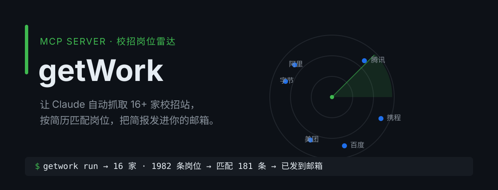

<p align="center">
  
</p>

## 这是什么

**getWork 是一个 MCP server**，把「翻校招官网找实习」这件事交给 Claude：

1. **抓** —— 覆盖 16+ 家校招站，每个岗位带完整职责与任职要求
2. **筛** —— 按你的简历画像给每岗算匹配度，运营、市场这类无关岗位直接剔除
3. **发** —— 生成带匹配度的简报，作为 HTML 正文 + PNG 长图发到你的邮箱

你只需要给 Claude 一句话：**「这是我的简历，帮我找合适的日常实习岗位。」**

## 能做什么

| 能力 | 说明 |
| --- | --- |
| `crawl_jobs` | 抓取某家公司的在招岗位与完整要求，支持翻页抓全量 |
| 匹配度 | 按简历技术栈给每岗打分并过滤无关岗位，附命中理由 |
| `render_briefing` | Markdown 简报 → HTML 正文 + PNG 长图 |
| `send_email` | SMTP 发信；定时任务可每天早上自动推一次 |
| `add_source` | 说一句「添加这个公司」，随时扩展目标清单 |

## 怎么工作

```
简历画像 (config/profile.yaml：方向/技术栈/地点)
        │
        ▼
   getWork MCP ── crawl_jobs ──▶ 16+ 校招站
        │                          │ 岗位 + 完整要求
        │  match.py 打分过滤       ▼
        │                    匹配岗位（带匹配度）
        ├── render_briefing ──▶ HTML + PNG
        └── send_email ──────▶ 你的邮箱
```

岗位抓取有三种策略，全部配置驱动，新增公司不用改代码：

- **platform** —— 直调校招站的 JSON API（美团、携程、百度、Moka 系等），含 Moka 响应的 AES 解密
- **dynamic** —— Playwright 渲染 SPA，捕获页面自己发出的岗位响应，绕开签名与 anti-bot
- **static** —— 普通 HTML 页面用 CSS 选择器抓取

## 快速开始

前置：Python 3.11+、[uv](https://docs.astral.sh/uv/)、Playwright

```bash
uv sync
uv run playwright install chromium
```

`.mcp.json` 已配好，项目级注册后即可在 Claude Code 里使用。把简历发给 Claude，或说：

> 我想找后端/全栈方向的日常实习，技术栈 Go、Java、TypeScript、React。

Claude 会走 `find-jobs` 流程：构建画像 → 抓取 → 匹配打分 → 生成简报 → 邮件推送。

### 已覆盖公司

腾讯 · 京东 · 字节跳动 · 阿里巴巴 · 得物 · 超聚变 · 贝壳 · 腾讯音乐 · 小红书 · 快手 · 网易 · 美团 · 滴滴 · 唯品会 · 携程 · 百度

> 岗位数据来自各公司官网公开的招聘页面，仅供个人求职参考，以官网发布为准。

## 项目结构

```
getwork/
  server.py        MCP 工具注册（crawl_jobs / render_briefing / send_email / add_source…）
  crawlers/        三种抓取策略：platform / static / dynamic
  match.py         画像匹配打分，过滤无关岗位
  briefing.py      Markdown → HTML + PNG
  mailer.py        SMTP 邮件推送
config/
  companies.yaml   校招站配置（新增公司只改这里）
  profile.yaml     求职画像（方向 / 技术栈 / 地点 / 收件邮箱）
.claude/skills/
  find-jobs        简历驱动的求职流程 skill
```

## 许可

[MIT](./LICENSE)
